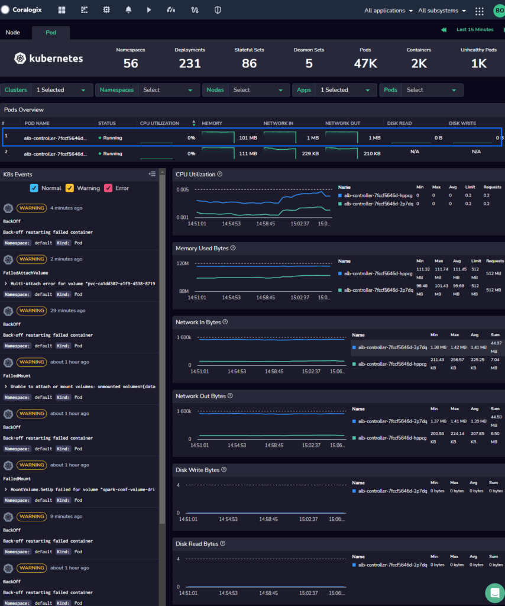

# Coralogix - Infrastructure Monitoring Integration

> [!IMPORTANT]
> Monitoring Shipper is deprecated and in maintenance mode. Please use [OpenTelemetry Integration](https://github.com/coralogix/telemetry-shippers/tree/master/otel-integration/k8s-helm) project, which provides full OpenTelemetry observability solution.

You can use OpenTelemetry Integration without logs by deploying with the following command:

```bash
helm upgrade --install otel-coralogix-integration coralogix/otel-integration --version=0.0.54 --render-subchart-notes --set global.domain="coralogix.com" --set global.clusterName="<cluster name>" --set "opentelemetry-agent.presets.logsCollection.enabled=false"
```

# Introduction

This repository contains the minimal OpenTelemetry barebones to have [Coralogix Kubernetes Monitoring](https://coralogix.com/docs/apm-kubernetes/) working out-of-the-box, ensuring only the required metrics are collected and shipped to the Coralogix Account.



## Coralogix's Domain

You have to choose the best Coralogix Endpoint based on your region and provide the required information on the values file under the path `global.domain`, you can find the list of all available domains by clicking [here](https://coralogix.com/docs/coralogix-endpoints/).

## Prerequisites

Make sure you have at least these version of the following installed:

- Kubernetes 1.24+
- Helm 3.9+

## Kubernetes integrations requirement

This agent requires a `secret` with the relevant `private key` under a secret key called `PRIVATE_KEY` on the same `namespace` the integration is installed in.

By default the agent is looking for a secret named `coralogix-opentelemetry-key` as you can see on `values.yaml`, you're free to change it to use an existing secret on your cluster if you need.

* The `private key` appears under 'Data Flow' --> 'API Keys' in Coralogix UI:

```bash
kubectl create secret generic coralogix-opentelemetry-key \
  -n <the-namespace-of-the-integrations> \
  --from-literal=PRIVATE_KEY=<private-key>
```

For more information regarding the coralogix private key please visit [here](https://coralogix.com/docs/private-key/)

The created secret should look like this:

```yaml
apiVersion: v1
data:
  PRIVATE_KEY: <encrypted-private-key>
kind: Secret
metadata:
  name: coralogix-opentelemetry-key
  namespace: <the-integration-namespace>
type: Opaque 
```

## Installation

Our Helm charts repository can be added to the local repos list with the following command. It will create a repository named `coralogix`. If you wish to change it to anything else, be sure to adapt your commands in the other segments referring to this repository.

```bash
helm repo add coralogix https://cgx.jfrog.io/artifactory/coralogix-charts-virtual
helm repo update
```

Now you can run the following command to install the helm chart on your cluster.

```bash
helm install <my-release> coralogix/coralogix-opentelemetry-integration
```

To uninstall the helm chart you can run:

```bash
helm delete <my-release>
```

## Local Development

Below you will find the required information to run the minimal agent in a local environment.

### Required tools
- [Helm](https://helm.sh/docs/intro/install/)
- [Kind](https://kind.sigs.k8s.io/)
- [Make](https://www.gnu.org/software/make/)

To run this minimal agent on your local environment, you must provide the Coralogix secret and run the following command.

```bash
make setup
```

To destroy the local environment, you need to run the following command.

```bash
make destroy
```

## Note On Metrics Cardinality

Please be aware that certain metrics collected by this agent have high cardinality, which means that the number of unique values for a given metric is high and might result in higher costs connected with metrics ingestion and storage. This is applies in particular to the pod related metrics `kube_pod_status_reason`, `kube_pod_status_phase` and `kube_pod_status_qos_class`.
